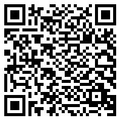

## About

Ambrosus Viewer is an Android application that uses the <a href="https://dev.ambrosus.com" target="_blank">Ambrosus API</a> combined with scanning technology to allow users to scan a Bar Code, QR Code, [or other 1D or 2D symbology - in development] and get details about an item moving through a supply chain.

Learn about scanned item, origins and other details such as temperature, weight, creation date, and more. See a timeline detailing all things that happened to the asset from the date of its creation to it arriving in stores. 

The application supports communication with a hardware device, which measures temperature, humidity, light and acceleration sensors records, it can log them, and communicate them over BLE. The data can be sent to the Ambrosus API

## Supported OS & SDK Versions

* Supports Android 5 and above devices which have BLE.
* Requires Camera permission enabled in order to scan codes
* Requires internet permission to send the data to the API.
* Capable of scanning codes with the following symbologies:
  * UPCE, UPC12, EAN8, EAN13, CODE 39, CODE 128, ITF, QR, DATAMATRIX

## Sample Symbologies

To see details about sample assets with the Ambrosus Viewer, scan any of the following codes from the app:

|   EAN-8   |   EAN-13   |     QR     |
| --------- | ---------------------------------- | ---------- |
| &emsp;&emsp;[EAN-8 Sample]   | &emsp;&emsp;[EAN-13 Sample] | &emsp;&emsp;&emsp;&emsp;
|  &emsp;  | &emsp;&emsp; | &emsp;&emsp;&emsp;&emsp;<a href="https://amb.to/0x602023f73ab25f0c95a3cf4e92c9cb2f4c9c09dbd3ca6e167d362de6e7f1eeae" target="_blank">PURE DARK CHOCOLATE BAR 92%</a>&emsp;&emsp;
